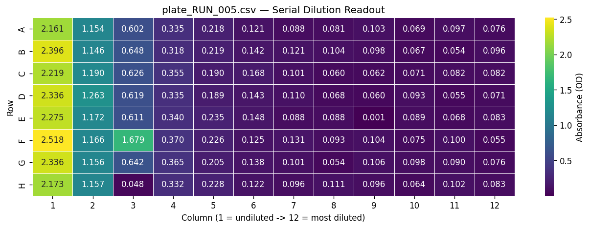

# Lab Automation Suite

A small, config-driven lab automation pipeline built with the Opentrons
Protocol API, Python, and Streamlit 

It demonstrates the three layers a real automation stack needs:

1. **Robot scripting** — a config-driven Opentrons protocol generator
   supporting three assay types (serial dilution, reagent dispensing,
   media exchange), with full validation before any robot movement.
2. **Monitoring & orchestration** — a file watcher that auto-ingests
   instrument output, runs QC, and consolidates results with drift
   detection across runs.
3. **Visualization** — a Streamlit dashboard for run history, plate
   heatmaps, and run-to-run comparison.



*Example output: a serial dilution readout. The gradient from column 1
(undiluted) to column 12 confirms the dilution series worked; the bright
spot at F3 is a randomly-injected outlier well, flagged FAIL by the QC
pipeline.*


## Why this project

Lab automation isn't just "make the robot move" — it's making sure the
**protocol parameters match what the biology on the other side actually
needs** (aspiration speed, tip height, air gaps to prevent
cross-contamination), and that the **data coming back out is trustworthy**
(QC scoring, outlier detection, drift monitoring across runs).

This project is small enough to read end-to-end in 20 minutes, but covers
all three of those concerns with real, runnable code and a passing test
suite.


## Project structure

```
lab-automation-suite/
├── config.yaml                  # single source of truth for all parameters
├── requirements.txt
├── run_pipeline.py               # end-to-end demo: protocol -> instrument -> QC -> summary
├── protocols/
│   └── protocol_generator.py     # config-driven Opentrons protocol (3 assay types)
├── instruments/
│   ├── mock_plate_reader.py      # simulated 96-well plate reader
│   ├── qc_utils.py                # CV%, outlier detection, pass/fail scoring
│   └── file_watcher.py            # watches a directory, auto-ingests results
├── dashboard/
│   └── app.py                     # Streamlit dashboard
├── tests/
│   ├── test_protocol_generator.py     # 14 tests: config validation
│   └── test_instruments_integration.py # 8 tests: instrument + watcher integration
└── data/
    ├── raw/                        # instrument output (generated at runtime)
    └── processed/                  # master_results.csv (generated at runtime)
```


## Setup

```bash
pip install -r requirements.txt
```


## Usage

### 1. Preview a protocol (no robot, no simulation — just the plan)

```bash
python3 protocols/protocol_generator.py --preview
```

Change `protocol.type` in `config.yaml` to `serial_dilution`,
`reagent_dispense`, or `media_exchange` to preview a different assay.

### 2. Simulate the protocol on the Opentrons simulator

```bash
opentrons_simulate protocols/protocol_generator.py
```

### 3. Run the full pipeline (protocol -> instrument -> watcher -> QC -> summary)

```bash
python3 run_pipeline.py
```

This generates several simulated plate measurements, writes them as CSVs,
and shows a file watcher picking each one up in real time, QC-scoring it,
and building a run history table with quality ranking and CV% drift
detection.

### 4. View the dashboard

```bash
streamlit run dashboard/app.py
```

### 5. Run the tests

```bash
pytest tests/ -v
```

22 tests covering config validation (all three assay types, plus invalid
configs), the mock instrument, the file watcher (real-time ingestion via
`PollingObserver`), and the QC scoring functions.


## Design notes worth knowing about

**Config-driven, not hardcoded.** Every volume, flow rate, tip clearance,
and air gap lives in `config.yaml`. Switching assays — or tuning a
parameter for a more fragile sample — means editing config, not protocol
code. `validate_config()` catches inconsistent configs (e.g. a transfer
volume that would overflow a well, or exceed tip capacity) *before* any
robot movement.

**Biological parameters are first-class.** `flow_rate_factor`,
`bottom_clearance_mm`, and `air_gap_ul` aren't robot-API trivia — they're
the difference between a protocol that's gentle on living samples and one
that introduces shear stress, foaming, or cross-contamination. They're
documented in `protocols/protocol_generator.py` with the biological
reasoning, not just the API mechanics.

**`PollingObserver`, not `Observer`.** The file watcher deliberately uses
`watchdog`'s `PollingObserver` rather than the OS-default observer.
`InotifyObserver` (the Linux default) silently detects *nothing* on
Windows-mounted drives accessed from WSL2 (`/mnt/c/...`, DrvFs) and on
some network/Docker mounts — a failure mode that's easy to miss because it
produces no error, just zero events. `PollingObserver` scans the directory
directly and works identically everywhere, at the cost of sub-second
latency that's irrelevant when measurements take minutes.

**Quality ranking uses a combined sort, not a single metric.** Runs are
ranked by pass rate first, then by mean CV% as a tiebreaker — avoiding a
naive `.rank()` call that breaks ties by row order and can make a
high-variance run look "best" purely by appearing first.


## What I'd extend next

- Real serial-port communication (`pyserial`) for an actual plate reader,
  replacing `MockPlateReader` with the same public interface.
- Bundling `config.yaml` as Opentrons protocol data so it runs unmodified
  on a physical OT-2/Flex (currently relies on a working-directory fallback
  for `__file__`, which is undefined inside Opentrons' `exec()` context).
- A fourth protocol type for incubator/plate-mover integration (SiLA2).


## Author

Bacha Zada — M.Sc. Computational Biology and Bioinformatics, University of
Göttingen. Background in protein purification (FPLC/SEC/IEX), ATAC-seq
pipelines, and Python/Snakemake workflow automation.
